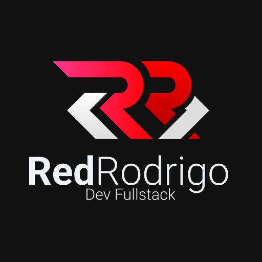

  

  # Rodrigo Castro
  ### aka **redrodrigo**

  
  
  
  

---

## 👨‍💻 Sobre mim

Engenheiro de software sênior com **10+ anos de experiência**, especializado em desenvolvimento mobile com Flutter e backend com PHP/Laravel. Atuo na **LWSA** e sou um dos organizadores do **[Flutterando](https://flutterando.com.br)** — a maior comunidade Flutter do Brasil, com mais de **30 mil membros**.

Aplico Clean Architecture, BLoC e Result Pattern no dia a dia, lidero iniciativas de qualidade com testes automatizados via **Playwright**, e contribuo com o ecossistema web usando Laravel, Vue.js e Ruby. Tenho experiência com clientes internacionais e projetos de alta complexidade em telecomunicações, ERP e produtos SaaS.

---

## 🚀 Projetos em destaque

**📱 App KingHost (LWSA)**
Primeiro produto mobile da empresa. Desenvolvimento frontend com Flutter (Clean Architecture + BLoC) e contribuição na construção dos endpoints backend em PHP/Laravel para o MVP.

**🩻 LaudosX**
Plataforma de telerradiologia com gestão de laudos médicos. Full-stack com Laravel e FilamentPHP, entregando um painel administrativo robusto e fluxo de trabalho para radiologistas remotos.

**🏗️ Design Systems**
Criação de bibliotecas de componentes reutilizáveis para times de produto, garantindo consistência visual e reduzindo tempo de desenvolvimento em até 70%.

**📡 Sistemas Telecom**
Soluções de gerenciamento para ISPs regionais com GPON, integração multi-vendor de OLTs (Huawei, ZTE, Datacom), automação via SNMP/SSH e provisionamento TR-069.

---

## 🛠️ Stack

### Mobile

### Backend & Web

### Qualidade & Infra

### Banco de dados

---

## 📊 GitHub Stats

  

  

---

## 🏆 Comunidade

- 🎯 **Organizador** do [Flutterando](https://flutterando.com.br) — maior comunidade Flutter do Brasil (30k+ membros)
- 🎤 **Palestrante** em DevFest, PHP Peste e outros eventos — temas: Flutter, FilamentPHP, Design Systems
- 📝 **Criador de conteúdo** — artigos técnicos, tutoriais e vídeos no YouTube
- 🤝 **Membro ativo** do PHP com Rapadura, PHP Paraíba e He4rt Developers

---

## 📫 Contato

Aberto a colaborações, palestras e projetos internacionais.

💼 [LinkedIn](https://www.linkedin.com/in/rodrigo-castro-8422a7145/) · 🐦 [Twitter](https://twitter.com/redrodrigoc) · 🎥 [YouTube](https://youtube.com/@redrodrigoc) · 💻 [redrodrigo.com](https://redrodrigo.com)

---

Made with ❤️ from João Pessoa, Brasil — **RED Rodrigo**

