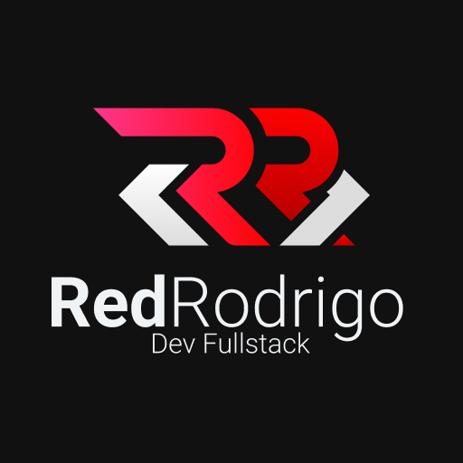

  

  # Rodrigo Castro
  ### aka **redrodrigo**

  
  
  
  

---

## 👨‍💻 Sobre mim

Engenheiro de software sênior com **8+ anos de experiência**, especializado em desenvolvimento mobile com Flutter e backend com PHP/Laravel. Atuo na **LWSA** e sou um dos organizadores do **[Flutterando](https://flutterando.com.br)** — a maior comunidade Flutter do Brasil, com mais de **30 mil membros**.

Aplico Clean Architecture, BLoC e Result Pattern no dia a dia, lidero iniciativas de qualidade com testes automatizados via **Playwright**, e contribuo com o ecossistema web usando Laravel, Vue.js e Ruby. Tenho experiência com clientes internacionais e projetos de alta complexidade em telecomunicações, ERP e produtos SaaS.

---

## 🚀 Projetos em destaque

**📱 App KingHost (LWSA)**
Primeiro produto mobile da empresa. Desenvolvimento frontend com Flutter (Clean Architecture + BLoC) e contribuição na construção dos endpoints backend em PHP/Laravel para o MVP.

**🔥 [Bonfire](https://bonfire.watch)**
Projeto pessoal publicado — app de rastreamento de filmes e séries, com diário de exibições, avaliações, listas e progresso de franquias. Stack completa: Flutter (Clean Architecture + BLoC) no app, Laravel + FilamentPHP no backend e Nuxt na landing e web app.

**🏗️ Design Systems**
Criação de bibliotecas de componentes reutilizáveis para times de produto, garantindo consistência visual e reduzindo tempo de desenvolvimento em até 70%.

**📡 Sistemas Telecom**
Soluções de gerenciamento para ISPs regionais com GPON, integração multi-vendor de OLTs (Huawei, ZTE, Datacom), automação via SNMP/SSH e provisionamento TR-069.

---

## 💡 Open Source

**[🧱 base_clean_arch_bloc](https://github.com/tecrodrigocastro/base_clean_arch_bloc)** 
Projeto base Flutter com Clean Architecture e BLoC para gerenciamento de estado, seguindo princípios de SOLID — ponto de partida usado em projetos próprios e de clientes.

**[🎨 design-system-flutter-template](https://github.com/tecrodrigocastro/design-system-flutter-template)** 
Template de design system para Flutter: design tokens, componentes em Atomic Design, documentação via DartDoc, galeria Widgetbook e um servidor MCP para assistentes de IA.

**[📦 dartisan](https://github.com/tecrodrigocastro/dartisan)** 
Servidor self-hosted e open source de repositório de pacotes Dart/Flutter, compatível com o protocolo pub (`dart pub` / `flutter pub`).

### 🤝 Contribuições

**[remote_pi](https://github.com/jacobaraujo7/remote_pi)** 
App Flutter para controlar seu agente de código Pi pelo celular — pareamento via QR code e chat com o agente local mesmo longe do computador.

---

## 🛠️ Stack

### Mobile

### Backend & Web

### Qualidade & Infra

### Banco de dados

---

## 📊 GitHub Stats

  
  

  

  

---

## 🏆 Comunidade

- 🎯 **Organizador** do [Flutterando](https://flutterando.com.br) — maior comunidade Flutter do Brasil (30k+ membros)
- 🎤 **Palestrante** em DevFest, PHP Peste e outros eventos — temas: Flutter, FilamentPHP, Design Systems
- 📝 **Criador de conteúdo** — artigos técnicos, tutoriais e vídeos no YouTube
- 🤝 **Membro ativo** do PHP com Rapadura, PHP Paraíba e He4rt Developers

---

## 📫 Contato

Aberto a colaborações, palestras e projetos internacionais.

💼 [LinkedIn](https://www.linkedin.com/in/rodrigo-castro-8422a7145/) · 🐦 [Twitter](https://twitter.com/redrodrigoc) · 🎥 [YouTube](https://youtube.com/@redrodrigoc) · 💻 [redrodrigo.com](https://redrodrigo.com)

---

Made with ❤️ from João Pessoa, Brasil — **RED Rodrigo**

